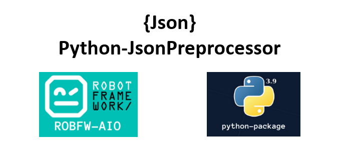

.. Copyright 2020-2022 Robert Bosch GmbH

.. Licensed under the Apache License, Version 2.0 (the "License");
   you may not use this file except in compliance with the License.
   You may obtain a copy of the License at

.. http://www.apache.org/licenses/LICENSE-2.0

.. Unless required by applicable law or agreed to in writing, software
   distributed under the License is distributed on an "AS IS" BASIS,
   WITHOUT WARRANTIES OR CONDITIONS OF ANY KIND, either express or implied.
   See the License for the specific language governing permissions and
   limitations under the License.

Json Preprocessor documentation
===============================

**This is the documentation for JsonPreprocessor Python package**

Json is a format used to represent data and becomes the universal standard of data 
exchange. Today many software projects are using Json format as a configuration file, 
for a big or a complex project, there is a need to have some enhanced format in json 
file such as adding the comments, importing other json files, etc.

Base on that needs, we develop JsonPreprocessor package which allows using the comments, 
importing other Json files, overwrite existing or add new parameters, and nested parameter.

